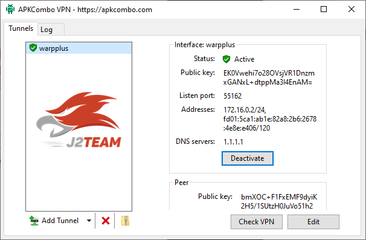
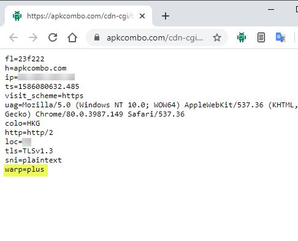

# APKCombo VPN - CloudFlare Warp+ for Windows
- A high performance VPN client that uses the CloudFlare WARP+.
- Simple & Easy-to-use.

> Made by  [J2TEAM Community](https://www.facebook.com/groups/j2team.community/) and sponsored by  [APKCombo APK Downloader](https://apkcombo.com)

## Installation (Windows 7, 8, 10)

- Download [apkcombovpn-0.1.0.msi](https://github.com/apkcombo/apkcombo-vpn/raw/master/apkcombovpn-0.1.0.msi) (Windows 64 bit)

- Download [apkcombovpn-x86-0.1.0.msi](https://github.com/apkcombo/apkcombo-vpn/raw/master/apkcombovpn-x86-0.1.0.msi) (Windows 32 bit)

## Quick Start

**Step 1:** Open **APKCombo VPN**.

**Step 2:** Click **"Active CloudFlare WARP+ VPN"** Button.

**Step 3:** Click **"Active"** Button to active "warpplus" Tunnel.

## How to check WARP+ is enabled and working
- [Click here to check WARP+](https://apkcombo.com/cdn-cgi/trace)
- You should see a line at the bottom such as `warp=plus`

## Screenshots

